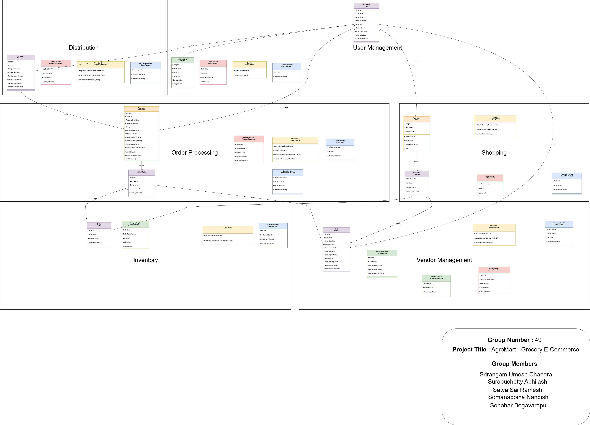

# AgroMart - A Multivendor Ecommerce Grocery Website

Welcome to AgroMart! AgroMart is a comprehensive multivendor e-commerce platform designed for grocery shopping, where vendors can list their products, and customers can browse, purchase, and manage their orders seamlessly. This README provides an overview of the features and functionalities of the website.

## 🌐 Live Demo

- 🔗 [https://agromart-client.onrender.com](https://agromart-mern-frontend.onrender.com)

## Contributors:
1. Srirangam Umesh Chandra (SPOC) (S20220010209):
2. Surapuchetty Abhilash (S20220010216):
3. Somanaboina Nandish (S20220010205):
4. Satya Sai Ramesh Panchakarla (S20220010162):
5. Sonohar Boggavarapu (S20220010041):

## Domain Driven Design Diagram

### For Customers:
- **User Authentication**: Secure signup and login functionality for customers.
- **Customer Dashboard**: A personalized dashboard where customers can view available products, manage their cart, and access their profile.
- **Cart Management**: Add, update, or remove items from the cart with a dynamic total price display.
- **Checkout Process**: Simple checkout process with payment integration (via Stripe).
- **Subscription Plans**: Customers can choose between different subscription plans (normal, pro, pro plus) to receive discounts on their purchases.
- **Profile Update**: Ability to update user profile information, including address and subscription type.
- **Order Management**: View order history and status updates on previous purchases.

### For Vendors:
- **Vendor Authentication**: Secure login for vendors to access their dashboard.
- **Vendor Dashboard**: A dedicated space for vendors to manage their products, view sales data, and analyze profits.
- **Product Management**: Add new products, update existing product information, and view sales statistics.
- **Profit Analysis**: Visual representation of profits earned through sales with easy-to-read charts.
- **Profile Update**: Option for vendors to update their profile information and passwords.

### For Admins:
- **Admin Dashboard**: Access to a comprehensive dashboard to manage the platform's overall operations.
- **User Management**: View and manage all users (customers and vendors) registered on the platform.
- **Order Processing**: Change order statuses and manage the fulfillment process.
- **Analytics and Reports**: Access to various reports and analytics to track sales, user activity, and overall platform performance.

## Tech Stack
- **Backend**: Node.js, Express.js
- **Database**: MongoDB
- **Frontend**: HTML, CSS, JavaScript
- **Payment Integration**: Stripe API
- **Charting Library**: Chart.js for profit visualization

## Getting Started
1. Clone the repository: `git clone https://github.com/srirangamuc/freshmart.git`
### Backend Setup:
1. Navigate to the project directory: `cd backend`
2. Install dependencies: `npm install`
3. Set up the database and environment variables.
4. Start the server: `npm start`.

### Frontend Setup:
1. Navigate to the project directory: `cd frontend`
2. Install dependencies: `npm install`
3. Start the development server: `npm run dev`.

## License
This project is licensed under the MIT License - see the [LICENSE](LICENSE) file for details.

## Contact
For any inquiries, please reach out to [Srirangam Umesh Chandra](mailto:uc3932@gmail.com).
